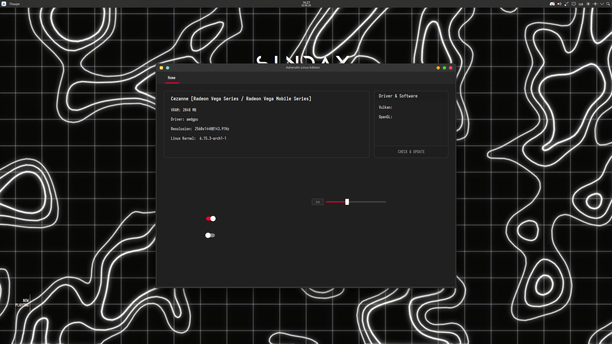

# Adrenalin Linux Edition

A modern control center for AMD GPUs on Linux — inspired by AMD's Adrenalin Software for Windows.  
This application provides a clean Qt-based GUI to monitor and interact with your GPU, system stats, and drivers.

> 💡 This project is in early development and growing steadily.  
> I welcome contributions and ideas — feel free to open an issue or join development!

---

## ✨ Features (WIP)

- [x] Display GPU model, resolution, VRAM, driver
- [x] Kernel version info
- [x] Driver & software detection
- [ ] Vulkan/OpenGL version display
- [ ] Fan and temperature monitoring
- [ ] Driver update assistant
- [ ] Game launcher integration (Steam, Lutris, etc.)
- [ ] Power profiles: Performance / Balanced / Silent
- [ ] GUI style toggles (dark/light)

---

## 📸 Screenshot



---

## 🛠️ Built With

- **Qt6 (C++)** — GUI
- `lshw`, `glxinfo`, `uname`, `vulkaninfo` — system info
- Designed for **Arch Linux** but adaptable to any distro

---

## 📦 Installation

*AppImage or Flatpak coming soon.*

Currently, you can build it manually with `qmake`:

```bash
git clone https://github.com/L0S1F/AdrenalinLinuxEdition.git
cd AdrenalinLinuxEdition

# If using Qt6 qmake:
qmake6 AdrenalinLinuxEdition.pro

# Or for Qt5:
# qmake AdrenalinLinuxEdition.pro

make
./AdrenalinLinuxEdition

